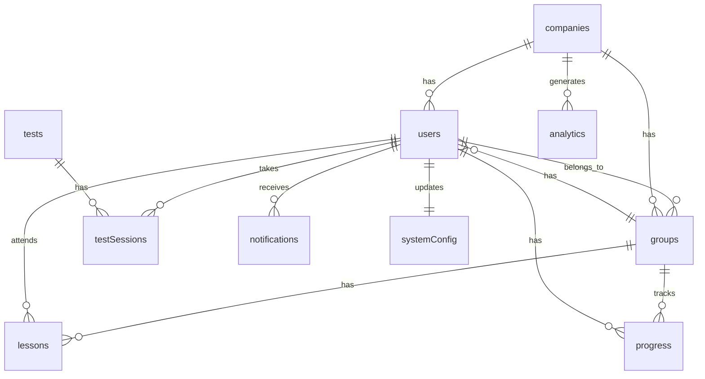

# System Architecture & Database Design
## Language School Management Platform

**Project:** Platform - Language School Management System  
**Date:** 2025-11-10  
**Architect:** Technical Architecture Team  
**Version:** 1.0  

---

## 1. Executive Summary

### 1.1 Architecture Overview
The Language School Management Platform is built on a modern, scalable architecture using **Convex** as the primary database and real-time synchronization engine, **React with TypeScript** for the frontend, and **RESTful APIs** for external service integrations.

### 1.2 Key Architecture Principles
- **Real-time First:** All user interactions and data updates are synchronized in real-time
- **Scalable by Design:** Architecture supports horizontal scaling and multi-tenant isolation
- **Security-First:** End-to-end encryption, role-based access control, and compliance-ready
- **API-Driven:** Clean separation between frontend and external service integrations
- **Progressive Enhancement:** Core functionality works offline with enhanced features online

### 1.3 Technology Stack
- **Frontend:** React 18+ with TypeScript, Tailwind CSS, Vite
- **Database:** Convex (Real-time, transactional, scalable)
- **Authentication:** Convex Auth with role-based access control
- **External APIs:** OpenRouter, ElevenLabs, Resend, Cambridge English
- **Deployment:** Vercel/Netlify (Frontend), Convex Cloud (Backend)
- **Monitoring:** Convex analytics, custom error tracking

---

## 2. System Architecture

### 2.1 High-Level Architecture Diagram

```
┌─────────────────────────────────────────────────────────────────┐
│                    LANGUAGE SCHOOL PLATFORM                     │
│                                                                 │
│  ┌─────────────────┐  ┌─────────────────┐  ┌─────────────────┐ │
│  │   ADMIN         │  │   TEACHER       │  │   STUDENT       │ │
│  │   INTERFACE     │  │   INTERFACE     │  │   INTERFACE     │ │
│  │                 │  │                 │  │                 │ │
│  │ • Dashboard     │  │ • Dashboard     │  │ • Dashboard     │ │
│  │ • User Mgmt     │  │ • Groups        │  │ • Test Taking   │ │
│  │ • Analytics     │  │ • Calendar      │  │ • Progress      │ │
│  │ • Settings      │  │ • Content       │  │ • Lessons       │ │
│  └─────────────────┘  └─────────────────┘  └─────────────────┘ │
│           │                   │                   │           │
│           └───────────────────┼───────────────────┘           │
│                               │                               │
│  ┌─────────────────────────────────────────────────────────┐  │
│  │              REACT FRONTEND APPLICATION                  │  │
│  │  • React 18+ with TypeScript                            │  │
│  │  • Tailwind CSS for styling                            │  │
│  │  • React Query for state management                    │  │
│  │  • React Router for navigation                         │  │
│  │  • Web Audio API for audio playback                    │  │
│  └─────────────────────────────────────────────────────────┘  │
│                               │                               │
│  ┌─────────────────────────────────────────────────────────┐  │
│  │              CONVEX BACKEND PLATFORM                    │  │
│  │                                                         │  │
│  │  ┌─────────────┐ ┌─────────────┐ ┌─────────────────────┐ │  │
│  │  │   DATABASE  │ │ REAL-TIME   │ │   AUTH & SECURITY   │ │  │
│  │  │             │ │ SYNC        │ │                     │ │  │
│  │  │ • Users     │ │             │ │ • JWT Tokens        │ │  │
│  │  │ • Companies │ │ • Live      │ │ • RBAC             │ │  │
│  │  │ • Groups    │ │   Queries   │ │ • Multi-tenant     │ │  │
│  │  │ • Tests     │ │ • Subs      │ │ • Session Mgmt     │ │  │
│  │  │ • Lessons   │ │ • Mutations │ │ • API Keys         │ │  │
│  │  │ • Results   │ │             │ │                     │ │  │
│  │  └─────────────┘ └─────────────┘ └─────────────────────┘ │  │
│  └─────────────────────────────────────────────────────────┘  │
│                               │                               │
│  ┌─────────────────────────────────────────────────────────┐  │
│  │                EXTERNAL API INTEGRATIONS                │  │
│  │                                                         │  │
│  │  ┌─────────────┐ ┌─────────────┐ ┌─────────────────────┐ │  │
│  │  │ OPENROUTER  │ │ ELEVENLABS  │ │      RESEND         │ │  │
│  │  │             │ │             │ │                     │ │  │
│  │  │ • AI Gen    │ │ • Text-to-  │ │ • Transactional     │ │  │
│  │  │   Content   │ │   Speech    │ │   Emails            │ │  │
│  │  │ • Questions │ │ • Multiple  │ │ • Templates         │ │  │
│  │  │ • Quizzes   │ │   Voices    │ │ • Analytics         │ │  │
│  │  │ • Model     │ │ • Audio     │ │ • Bounce Handling   │ │  │
│  │  │   Selection │ │   Quality   │ │                     │ │  │
│  │  └─────────────┘ └─────────────┘ └─────────────────────┘ │  │
│  │                                                         │  │
│  │  ┌─────────────────────────────────────────────────────┐ │  │
│  │  │            CAMBRIDGE ENGLISH TESTING                │ │  │
│  │  │  • Assessment Integration                           │ │  │
│  │  │  • Score Processing                                 │ │  │
│  │  │  • Group Allocation                                 │ │  │
│  │  │  • Certification Tracking                           │ │  │
│  │  └─────────────────────────────────────────────────────┘ │  │
│  └─────────────────────────────────────────────────────────┘  │
│                                                                 │
│  ┌─────────────────────────────────────────────────────────┐  │
│  │              MONITORING & ANALYTICS                     │  │
│  │  • Convex Analytics                                     │  │
│  │  • Custom Business Metrics                              │  │
│  │  • Performance Monitoring                               │  │
│  │  • Error Tracking                                       │  │
│  └─────────────────────────────────────────────────────────┘  │
└─────────────────────────────────────────────────────────────────┘
```

### 2.2 Component Architecture

#### 2.2.1 Frontend Architecture
**React Application Structure:**
```
src/
├── components/
│   ├── ui/                     # Reusable UI components
│   │   ├── Button.tsx
│   │   ├── Card.tsx
│   │   ├── Input.tsx
│   │   ├── Modal.tsx
│   │   └── Navigation.tsx
│   ├── admin/                  # Administrative interface
│   │   ├── Dashboard.tsx
│   │   ├── UserManagement.tsx
│   │   ├── CorporateClients.tsx
│   │   └── Analytics.tsx
│   ├── teacher/                # Teacher interface
│   │   ├── TeacherDashboard.tsx
│   │   ├── GroupManagement.tsx
│   │   ├── LessonCalendar.tsx
│   │   └── ContentCreator.tsx
│   └── student/                # Student interface
│       ├── StudentDashboard.tsx
│       ├── TestInterface.tsx
│       ├── LearningExperience.tsx
│       └── ProgressTracker.tsx
├── hooks/                      # Custom React hooks
│   ├── useAuth.ts
│   ├── useRealtime.ts
│   ├── useNotifications.ts
│   └── useAudio.ts
├── services/                   # API integration layer
│   ├── convex.ts              # Convex client setup
│   ├── openRouter.ts          # OpenRouter API
│   ├── elevenLabs.ts          # ElevenLabs API
│   ├── resend.ts              # Resend API
│   └── cambridge.ts           # Cambridge English API
├── stores/                     # State management
│   ├── authStore.ts
│   ├── appStore.ts
│   └── uiStore.ts
├── utils/                      # Utility functions
│   ├── validation.ts
│   ├── formatting.ts
│   └── constants.ts
└── types/                      # TypeScript definitions
    ├── user.ts
    ├── company.ts
    ├── test.ts
    └── lesson.ts
```

#### 2.2.2 Backend Architecture
**Convex Schema Structure:**
```
convex/
├── schema.ts                   # Main database schema
├── mutations/                  # Data mutations
│   ├── auth.ts
│   ├── userManagement.ts
│   ├── groupManagement.ts
│   ├── testProcessing.ts
│   ├── contentCreation.ts
│   └── notificationManagement.ts
├── queries/                    # Data queries
│   ├── userQueries.ts
│   ├── analyticsQueries.ts
│   ├── groupQueries.ts
│   └── progressQueries.ts
├── functions/                  # Server functions
│   ├── aiContent.ts
│   ├── audioProcessing.ts
│   ├── emailProcessing.ts
│   └── testScoring.ts
└── utils/                      # Backend utilities
    ├── auth.ts
    ├── validation.ts
    └── externalAPIs.ts
```

### 2.3 Data Flow Architecture

#### 2.3.1 User Authentication Flow
```
1. User Login Attempt
   ↓
2. Convex Auth Validation
   ↓
3. Role-Based Permission Check
   ↓
4. JWT Token Generation
   ↓
5. Real-time Session Establishment
   ↓
6. UI Role-Specific Interface Loading
```

#### 2.3.2 Test Taking Flow
```
1. Student Starts Assessment
   ↓
2. Cambridge English API Call
   ↓
3. Real-time Question Delivery
   ↓
4. Student Response Processing
   ↓
5. Score Calculation & Storage
   ↓
6. Group Allocation Algorithm
   ↓
7. Teacher Assignment
   ↓
8. Email Notifications (Resend)
   ↓
9. Real-time Updates to All Stakeholders
```

#### 2.3.3 AI Content Creation Flow
```
1. Teacher Requests Content
   ↓
2. OpenRouter API Integration
   ↓
3. AI Content Generation
   ↓
4. Content Validation & Review
   ↓
5. ElevenLabs Audio Generation (if needed)
   ↓
6. Content Storage in Convex
   ↓
7. Real-time Availability to Students
```

---

## 3. Database Schema Design

### 3.1 Convex Database Schema

```typescript
// schema.ts
import { defineSchema, defineTable, defineField, defineIndex } from 'convex/schema';

// Define the main schema
export default defineSchema({
  // Core user management
  users: defineTable({
    // Identity fields
    email: defineField(v.string()).search(),
    name: defineField(v.string()).search(),
    profileImage: defineField(v.optional(v.string())),
    emailVerified: defineField(v.boolean()).default(false),
    role: defineField(v.union(
      v.literal('super_admin'),
      v.literal('school_admin'),
      v.literal('corporate_admin'),
      v.literal('teacher'),
      v.literal('student')
    )),
    
    // Company association
    companyId: defineField(v.id('companies')),
    groupId: defineField(v.optional(v.id('groups'))),
    
    // Profile information
    phone: defineField(v.optional(v.string())),
    timezone: defineField(v.string()).default('UTC'),
    language: defineField(v.string()).default('en'),
    
    // Learning progress
    level: defineField(v.optional(v.union(
      v.literal('beginner'),
      v.literal('intermediate'),
      v.literal('advanced'),
      v.literal('upper_intermediate')
    ))),
    currentScore: defineField(v.optional(v.number())),
    completedLessons: defineField(v.array(v.id('lessons'))),
    
    // Status and tracking
    status: defineField(v.union(
      v.literal('active'),
      v.literal('inactive'),
      v.literal('pending'),
      v.literal('suspended')
    )).default('pending'),
    lastActive: defineField(v.optional(v.number())),
    createdAt: defineField(v.number()),
    updatedAt: defineField(v.number())
  }).index('by_email', ['email'])
    .index('by_company', ['companyId'])
    .index('by_group', ['groupId']),

  // Company/Corporate Client Management
  companies: defineTable({
    name: defineField(v.string()).search(),
    domain: defineField(v.string()).search(),
    logo: defineField(v.optional(v.string())),
    address: defineField(v.optional(v.string())),
    website: defineField(v.optional(v.string())),
    
    // Contact information
    adminName: defineField(v.string()),
    adminEmail: defineField(v.string()),
    adminPhone: defineField(v.optional(v.string())),
    
    // Subscription and billing
    subscriptionStatus: defineField(v.union(
      v.literal('trial'),
      v.literal('active'),
      v.literal('suspended'),
      v.literal('cancelled')
    )).default('trial'),
    planType: defineField(v.union(
      v.literal('basic'),
      v.literal('professional'),
      v.literal('enterprise')
    )).default('basic'),
    monthlyCost: defineField(v.number()).default(0),
    billingCycle: defineField(v.union(
      v.literal('monthly'),
      v.literal('quarterly'),
      v.literal('yearly')
    )).default('monthly'),
    
    // Usage tracking
    userCount: defineField(v.number()).default(0),
    maxUsers: defineField(v.number()).default(10),
    
    // Configuration
    settings: defineField(v.object({
      testFrequency: defineField(v.number()).default(30), // days
      autoGrouping: defineField(v.boolean()).default(true),
      emailNotifications: defineField(v.boolean()).default(true),
      customBranding: defineField(v.optional(v.object({
        logo: defineField(v.string()),
        colors: defineField(v.object({
          primary: defineField(v.string()),
          secondary: defineField(v.string())
        }))
      })))
    })),
    
    // Status and dates
    status: defineField(v.union(
      v.literal('active'),
      v.literal('trial'),
      v.literal('suspended'),
      v.literal('cancelled')
    )).default('trial'),
    trialEndDate: defineField(v.optional(v.number())),
    createdAt: defineField(v.number()),
    updatedAt: defineField(v.number())
  }).index('by_domain', ['domain'])
    .index('by_status', ['status']),

  // Group Management
  groups: defineTable({
    name: defineField(v.string()).search(),
    level: defineField(v.union(
      v.literal('beginner'),
      v.literal('intermediate'),
      v.literal('advanced')
    )),
    companyId: defineField(v.id('companies')),
    teacherId: defineField(v.id('users')),
    
    // Group configuration
    maxStudents: defineField(v.number()).default(20),
    currentStudentCount: defineField(v.number()).default(0),
    description: defineField(v.optional(v.string())),
    
    // Schedule information
    schedule: defineField(v.object({
      dayOfWeek: defineField(v.array(v.number())), // 0-6
      timeSlot: defineField(v.object({
        hour: defineField(v.number()),
        minute: defineField(v.number())
      })),
      duration: defineField(v.number()), // minutes
      location: defineField(v.union(
        v.literal('online'),
        v.literal('classroom'),
        v.literal('hybrid')
      )).default('online')
    })),
    
    // Performance metrics
    averageScore: defineField(v.optional(v.number())),
    completionRate: defineField(v.optional(v.number())),
    
    // Status
    status: defineField(v.union(
      v.literal('active'),
      v.literal('inactive'),
      v.literal('full'),
      v.literal('archived')
    )).default('active'),
    createdAt: defineField(v.number()),
    updatedAt: defineField(v.number())
  }).index('by_company', ['companyId'])
    .index('by_teacher', ['teacherId'])
    .index('by_level', ['level']),

  // Test and Assessment Management
  tests: defineTable({
    name: defineField(v.string()),
    type: defineField(v.union(
      v.literal('cambridge_english'),
      v.literal('ai_generated'),
      v.literal('custom'),
      v.literal('placement')
    )),
    
    // Test configuration
    difficulty: defineField(v.union(
      v.literal('beginner'),
      v.literal('intermediate'),
      v.literal('advanced')
    )),
    duration: defineField(v.number()), // minutes
    questionCount: defineField(v.number()),
    
    // Content
    questions: defineField(v.array(v.object({
      id: defineField(v.string()),
      type: defineField(v.union(
        v.literal('multiple_choice'),
        v.literal('fill_blank'),
        v.literal('listening'),
        v.literal('speaking')
      )),
      question: defineField(v.string()),
      options: defineField(v.optional(v.array(v.string()))),
      correctAnswer: defineField(v.string()),
      explanation: defineField(v.optional(v.string())),
      audioUrl: defineField(v.optional(v.string())),
      points: defineField(v.number()).default(1)
    }))),
    
    // AI content metadata
    aiMetadata: defineField(v.optional(v.object({
      model: defineField(v.string()),
      prompt: defineField(v.string()),
      generatedAt: defineField(v.number()),
      reviewStatus: defineField(v.union(
        v.literal('pending'),
        v.literal('approved'),
        v.literal('rejected')
      )).default('pending')
    }))),
    
    // Usage tracking
    timesTaken: defineField(v.number()).default(0),
    averageScore: defineField(v.optional(v.number())),
    
    // Status
    status: defineField(v.union(
      v.literal('draft'),
      v.literal('active'),
      v.literal('archived')
    )).default('draft'),
    createdBy: defineField(v.id('users')),
    createdAt: defineField(v.number()),
    updatedAt: defineField(v.number())
  }).index('by_type', ['type'])
    .index('by_difficulty', ['difficulty'])
    .index('by_status', ['status']),

  // Test Sessions and Results
  testSessions: defineTable({
    testId: defineField(v.id('tests')),
    userId: defineField(v.id('users')),
    groupId: defineField(v.optional(v.id('groups'))),
    
    // Session tracking
    status: defineField(v.union(
      v.literal('in_progress'),
      v.literal('completed'),
      v.literal('abandoned'),
      v.literal('expired')
    )).default('in_progress'),
    
    // Timing
    startTime: defineField(v.number()),
    endTime: defineField(v.optional(v.number())),
    timeLimit: defineField(v.number()), // minutes
    timeSpent: defineField(v.optional(v.number())), // actual time in seconds
    
    // Answers and scoring
    answers: defineField(v.array(v.object({
      questionId: defineField(v.string()),
      answer: defineField(v.string()),
      correct: defineField(v.optional(v.boolean())),
      timeSpent: defineField(v.number()) // seconds
    }))),
    
    // Results
    totalScore: defineField(v.optional(v.number())),
    maxScore: defineField(v.number()),
    percentageScore: defineField(v.optional(v.number())),
    skillScores: defineField(v.optional(v.object({
      reading: defineField(v.optional(v.number())),
      listening: defineField(v.optional(v.number())),
      writing: defineField(v.optional(v.number())),
      speaking: defineField(v.optional(v.number()))
    }))),
    
    // Assignment
    assignedGroup: defineField(v.optional(v.id('groups'))),
    recommendedLevel: defineField(v.optional(v.union(
      v.literal('beginner'),
      v.literal('intermediate'),
      v.literal('advanced'),
      v.literal('upper_intermediate')
    ))),
    
    createdAt: defineField(v.number()),
    updatedAt: defineField(v.number())
  }).index('by_user', ['userId'])
    .index('by_test', ['testId'])
    .index('by_status', ['status']),

  // Lessons and Learning Content
  lessons: defineTable({
    title: defineField(v.string()).search(),
    description: defineField(v.optional(v.string())),
    groupId: defineField(v.id('groups')),
    teacherId: defineField(v.id('users')),
    
    // Content structure
    content: defineField(v.array(v.object({
      type: defineField(v.union(
        v.literal('text'),
        v.literal('video'),
        v.literal('audio'),
        v.literal('interactive'),
        v.literal('quiz')
      )),
      title: defineField(v.string()),
      content: defineField(v.string()),
      audioUrl: defineField(v.optional(v.string())),
      videoUrl: defineField(v.optional(v.string())),
      order: defineField(v.number())
    }))),
    
    // Learning objectives
    objectives: defineField(v.array(v.string())),
    skills: defineField(v.array(v.string())),
    
    // Schedule
    scheduledDate: defineField(v.number()),
    duration: defineField(v.number()), // minutes
    location: defineField(v.union(
      v.literal('online'),
      v.literal('classroom'),
      v.literal('hybrid')
    )).default('online'),
    
    // Attendance tracking
    attendance: defineField(v.array(v.object({
      userId: defineField(v.id('users')),
      status: defineField(v.union(
        v.literal('present'),
        v.literal('absent'),
        v.literal('late'),
        v.literal('excused')
      )),
      checkedInAt: defineField(v.optional(v.number()))
    }))),
    
    // Status
    status: defineField(v.union(
      v.literal('scheduled'),
      v.literal('in_progress'),
      v.literal('completed'),
      v.literal('cancelled')
    )).default('scheduled'),
    createdAt: defineField(v.number()),
    updatedAt: defineField(v.number())
  }).index('by_group', ['groupId'])
    .index('by_teacher', ['teacherId'])
    .index('by_date', ['scheduledDate']),

  // Progress Tracking
  progress: defineTable({
    userId: defineField(v.id('users')),
    groupId: defineField(v.id('groups')),
    
    // Learning metrics
    lessonsCompleted: defineField(v.number()).default(0),
    totalLessons: defineField(v.number()).default(0),
    completionPercentage: defineField(v.number()).default(0),
    
    // Skill progression
    skillLevels: defineField(v.object({
      reading: defineField(v.number()).default(0), // 1-100
      listening: defineField(v.number()).default(0),
      writing: defineField(v.number()).default(0),
      speaking: defineField(v.number()).default(0)
    })),
    
    // Assessment history
    testScores: defineField(v.array(v.object({
      testId: defineField(v.id('tests')),
      sessionId: defineField(v.id('testSessions')),
      score: defineField(v.number()),
      date: defineField(v.number())
    }))),
    
    // Goals and achievements
    goals: defineField(v.array(v.object({
      type: defineField(v.union(
        v.literal('lesson_completion'),
        v.literal('test_score'),
        v.literal('skill_improvement')
      )),
      target: defineField(v.number()),
      current: defineField(v.number()).default(0),
      dueDate: defineField(v.optional(v.number()))
    }))),
    
    // Streaks and engagement
    learningStreak: defineField(v.number()).default(0),
    lastActivityDate: defineField(v.optional(v.number())),
    
    updatedAt: defineField(v.number())
  }).index('by_user', ['userId'])
    .index('by_group', ['groupId']),

  // Communications and Notifications
  notifications: defineTable({
    userId: defineField(v.id('users')),
    type: defineField(v.union(
      v.literal('email'),
      v.literal('in_app'),
      v.literal('push')
    )),
    category: defineField(v.union(
      v.literal('test_reminder'),
      v.literal('lesson_notification'),
      v.literal('result_announcement'),
      v.literal('group_assignment'),
      v.literal('system_update'),
      v.literal('achievement')
    )),
    
    // Content
    title: defineField(v.string()),
    message: defineField(v.string()),
    actionUrl: defineField(v.optional(v.string())),
    
    // Delivery tracking
    status: defineField(v.union(
      v.literal('pending'),
      v.literal('sent'),
      v.literal('delivered'),
      v.literal('read'),
      v.literal('failed')
    )).default('pending'),
    sentAt: defineField(v.optional(v.number())),
    deliveredAt: defineField(v.optional(v.number())),
    readAt: defineField(v.optional(v.number())),
    
    // Metadata
    metadata: defineField(v.optional(v.object({
      testId: defineField(v.optional(v.id('tests'))),
      lessonId: defineField(v.optional(v.id('lessons'))),
      groupId: defineField(v.optional(v.id('groups'))),
      companyId: defineField(v.optional(v.id('companies')))
    }))),
    
    createdAt: defineField(v.number())
  }).index('by_user', ['userId'])
    .index('by_status', ['status'])
    .index('by_category', ['category']),

  // Analytics and Reporting
  analytics: defineTable({
    date: defineField(v.string()), // YYYY-MM-DD format
    companyId: defineField(v.optional(v.id('companies'))),
    
    // User metrics
    activeUsers: defineField(v.number()).default(0),
    newUsers: defineField(v.number()).default(0),
    totalUsers: defineField(v.number()).default(0),
    
    // Learning metrics
    lessonsCompleted: defineField(v.number()).default(0),
    testsTaken: defineField(v.number()).default(0),
    averageScore: defineField(v.optional(v.number())),
    
    // Business metrics
    revenue: defineField(v.number()).default(0),
    churnRate: defineField(v.optional(v.number())),
    engagementRate: defineField(v.optional(v.number())),
    
    createdAt: defineField(v.number())
  }).index('by_date', ['date'])
    .index('by_company', ['companyId']),

  // System Configuration
  systemConfig: defineTable({
    key: defineField(v.string()).search(),
    value: defineField(v.string()),
    category: defineField(v.union(
      v.literal('api_keys'),
      v.literal('feature_flags'),
      v.literal('system_settings'),
      v.literal('integration_config')
    )),
    description: defineField(v.optional(v.string())),
    updatedBy: defineField(v.optional(v.id('users'))),
    updatedAt: defineField(v.number())
  }).index('by_key', ['key'])
    .index('by_category', ['category'])
});

// Helper types for easier TypeScript usage
export type User = typeof users.defaultData;
export type Company = typeof companies.defaultData;
export type Group = typeof groups.defaultData;
export type Test = typeof tests.defaultData;
export type TestSession = typeof testSessions.defaultData;
export type Lesson = typeof lessons.defaultData;
export type Progress = typeof progress.defaultData;
export type Notification = typeof notifications.defaultData;
export type Analytics = typeof analytics.defaultData;
export type SystemConfig = typeof systemConfig.defaultData;
```

### 3.2 Database Relationships



### 3.3 Real-time Data Synchronization

**Convex Real-time Features:**
- **Live Queries:** Automatic UI updates when data changes
- **Optimistic Updates:** Immediate UI feedback before server confirmation
- **Offline Support:** Local data caching and synchronization
- **Conflict Resolution:** Automatic handling of concurrent updates

**Real-time Use Cases:**
```typescript
// Real-time lesson attendance
const lessonAttendance = useQuery(api.lessons.getAttendance, args);

// Real-time test progress
const testProgress = useQuery(api.testSessions.getProgress, args);

// Real-time group member updates
const groupMembers = useQuery(api.groups.getMembers, args);

// Real-time notifications
const notifications = useQuery(api.notifications.getUnread, args);
```

---

## 4. API Integration Architecture

### 4.1 External API Integration Layer

#### 4.1.1 OpenRouter Integration (AI Content Generation)
```typescript
// services/openRouter.ts
import { OpenRouterAPI } from 'openrouter';

class OpenRouterService {
  private api: OpenRouterAPI;
  private apiKey: string;

  constructor(apiKey: string) {
    this.apiKey = apiKey;
    this.api = new OpenRouterAPI({
      apiKey: apiKey,
      baseURL: 'https://openrouter.ai/api/v1'
    });
  }

  async generateTestQuestions(params: {
    topic: string;
    difficulty: 'beginner' | 'intermediate' | 'advanced';
    questionCount: number;
    cambridgeAligned: boolean;
  }): Promise<GeneratedQuestion[]> {
    const prompt = this.buildQuestionPrompt(params);
    
    const response = await this.api.chat.completions.create({
      model: 'anthropic/claude-3-sonnet',
      messages: [
        {
          role: 'system',
          content: 'You are an expert English language test creator...'
        },
        {
          role: 'user',
          content: prompt
        }
      ],
      temperature: 0.7,
      max_tokens: 2000
    });

    return this.parseQuestions(response.choices[0].message.content);
  }

  private buildQuestionPrompt(params: any): string {
    return `
      Create ${params.questionCount} English language questions for ${params.difficulty} level.
      Topic: ${params.topic}
      ${params.cambridgeAligned ? 'Align with Cambridge English standards.' : ''}
      
      Return as JSON array with structure:
      {
        "type": "multiple_choice|fill_blank|listening",
        "question": "Question text",
        "options": ["A", "B", "C", "D"], // for multiple choice
        "correctAnswer": "correct answer",
        "explanation": "why this is correct"
      }
    `;
  }
}

interface GeneratedQuestion {
  type: 'multiple_choice' | 'fill_blank' | 'listening';
  question: string;
  options?: string[];
  correctAnswer: string;
  explanation: string;
}
```

#### 4.1.2 ElevenLabs Integration (Text-to-Speech)
```typescript
// services/elevenLabs.ts
import { ElevenLabsAPI } from 'elevenlabs';

class ElevenLabsService {
  private api: ElevenLabsAPI;
  private apiKey: string;

  constructor(apiKey: string) {
    this.apiKey = apiKey;
    this.api = new ElevenLabsAPI({
      apiKey: apiKey
    });
  }

  async generateAudio(params: {
    text: string;
    voiceId: string;
    quality: 'standard' | 'premium';
  }): Promise<AudioResponse> {
    const response = await this.api.textToSpeech(params.voiceId, {
      text: params.text,
      model_id: params.quality === 'premium' ? 'eleven_monolingual_v1' : 'eleven_turbo_v2',
      voice_settings: {
        stability: 0.5,
        similarity_boost: 0.8
      }
    });

    return {
      audioUrl: response.audio_url,
      duration: response.duration,
      voiceId: params.voiceId
    };
  }

  async getAvailableVoices(): Promise<Voice[]> {
    const voices = await this.api.voices.getAll();
    return voices.voices.map(voice => ({
      id: voice.voice_id,
      name: voice.name,
      category: voice.category,
      description: voice.description,
      previewUrl: voice.preview_url
    }));
  }

  async generateListeningExercise(params: {
    questionText: string;
    options: string[];
    correctAnswer: string;
    voiceId?: string;
  }): Promise<ListeningExercise> {
    const voiceId = params.voiceId || this.getDefaultVoice();
    
    const audioPrompt = `${params.questionText}. ${params.options.join('. ')} The correct answer is ${params.correctAnswer}.`;
    
    const audio = await this.generateAudio({
      text: audioPrompt,
      voiceId: voiceId,
      quality: 'premium'
    });

    return {
      question: params.questionText,
      options: params.options,
      correctAnswer: params.correctAnswer,
      audioUrl: audio.audioUrl,
      duration: audio.duration,
      voiceId: voiceId
    };
  }

  private getDefaultVoice(): string {
    return 'pNInz6obpgDQGcFmaJgB'; // Adam voice
  }
}

interface AudioResponse {
  audioUrl: string;
  duration: number;
  voiceId: string;
}

interface Voice {
  id: string;
  name: string;
  category: string;
  description: string;
  previewUrl: string;
}

interface ListeningExercise {
  question: string;
  options: string[];
  correctAnswer: string;
  audioUrl: string;
  duration: number;
  voiceId: string;
}
```

#### 4.1.3 Resend Integration (Email Service)
```typescript
// services/resend.ts
import { Resend } from 'resend';

class ResendService {
  private resend: Resend;
  private apiKey: string;
  private domain: string;

  constructor(apiKey: string, domain: string) {
    this.apiKey = apiKey;
    this.domain = domain;
    this.resend = new Resend(apiKey);
  }

  async sendEmail(params: {
    to: string | string[];
    subject: string;
    template: EmailTemplate;
    data: any;
  }): Promise<EmailResponse> {
    const emailData = await this.renderTemplate(params.template, params.data);
    
    const response = await this.resend.emails.send({
      from: `Language School Platform <noreply@${this.domain}>`,
      to: Array.isArray(params.to) ? params.to : [params.to],
      subject: params.subject,
      html: emailData.html,
      text: emailData.text,
      tags: [
        { name: 'category', value: params.template.category },
        { name: 'user_type', value: params.data.userType }
      ]
    });

    return {
      emailId: response.id,
      status: response.status,
      sentAt: new Date()
    };
  }

  async sendBatchEmails(params: {
    recipients: Array<{
      email: string;
      data: any;
    }>;
    template: EmailTemplate;
    subject: string;
  }): Promise<BatchEmailResponse> {
    const emails = await Promise.all(
      params.recipients.map(async (recipient) => {
        const emailData = await this.renderTemplate(params.template, {
          ...params.data,
          ...recipient.data
        });
        
        return {
          from: `Language School Platform <noreply@${this.domain}>`,
          to: [recipient.email],
          subject: params.subject,
          html: emailData.html,
          text: emailData.text
        };
      })
    );

    const response = await this.resend.emails.sendBatch(emails);
    
    return {
      batchId: response.id,
      sent: response.sent,
      failed: response.failed
    };
  }

  async sendTestInvitation(params: {
    recipientEmail: string;
    companyName: string;
    companyAdminName: string;
    testLink: string;
  }): Promise<EmailResponse> {
    return this.sendEmail({
      to: params.recipientEmail,
      subject: `English Assessment Invitation - ${params.companyName}`,
      template: EmailTemplate.TEST_INVITATION,
      data: {
        companyName: params.companyName,
        companyAdminName: params.companyAdminName,
        testLink: params.testLink,
        userType: 'student'
      }
    });
  }

  async sendTestResults(params: {
    recipientEmail: string;
    studentName: string;
    testScore: number;
    skillBreakdown: SkillBreakdown;
    assignedGroup: string;
    nextSteps: string;
  }): Promise<EmailResponse> {
    return this.sendEmail({
      to: params.recipientEmail,
      subject: `Your English Assessment Results`,
      template: EmailTemplate.TEST_RESULTS,
      data: {
        studentName: params.studentName,
        testScore: params.testScore,
        skillBreakdown: params.skillBreakdown,
        assignedGroup: params.assignedGroup,
        nextSteps: params.nextSteps,
        userType: 'student'
      }
    });
  }

  private async renderTemplate(template: EmailTemplate, data: any): Promise<{ html: string; text: string }> {
    // Template rendering logic
    const templates = {
      [EmailTemplate.TEST_INVITATION]: {
        html: this.renderTestInvitationHTML(data),
        text: this.renderTestInvitationText(data)
      },
      [EmailTemplate.TEST_RESULTS]: {
        html: this.renderTestResultsHTML(data),
        text: this.renderTestResultsText(data)
      }
    };

    return templates[template];
  }

  private renderTestInvitationHTML(data: any): string {
    return `
      <h1>English Assessment Invitation</h1>
      <p>Dear participant,</p>
      <p>${data.companyAdminName} has invited you to take an English assessment for ${data.companyName}.</p>
      <p>Please click the link below to begin your assessment:</p>
      <a href="${data.testLink}">Start Assessment</a>
      <p>This assessment will take approximately 30-45 minutes.</p>
    `;
  }

  private renderTestInvitationText(data: any): string {
    return `
      English Assessment Invitation
      
      Dear participant,
      
      ${data.companyAdminName} has invited you to take an English assessment for ${data.companyName}.
      
      Please visit: ${data.testLink} to begin your assessment.
      
      This assessment will take approximately 30-45 minutes.
    `;
  }

  // Additional template rendering methods...
}

enum EmailTemplate {
  TEST_INVITATION = 'test_invitation',
  TEST_RESULTS = 'test_results',
  LESSON_REMINDER = 'lesson_reminder',
  GROUP_ASSIGNMENT = 'group_assignment'
}

interface EmailResponse {
  emailId: string;
  status: string;
  sentAt: Date;
}

interface BatchEmailResponse {
  batchId: string;
  sent: number;
  failed: number;
}

interface SkillBreakdown {
  reading: number;
  listening: number;
  writing: number;
  speaking: number;
}
```

#### 4.1.4 Cambridge English Integration
```typescript
// services/cambridge.ts
class CambridgeEnglishService {
  private apiKey: string;
  private baseUrl: string;

  constructor(apiKey: string) {
    this.apiKey = apiKey;
    this.baseUrl = 'https://api.cambridgeenglish.org/v1';
  }

  async createAssessment(params: {
    level: 'A1' | 'A2' | 'B1' | 'B2' | 'C1' | 'C2';
    testType: 'placement' | 'progress' | 'certification';
    candidateId: string;
    duration: number;
  }): Promise<AssessmentResponse> {
    const response = await fetch(`${this.baseUrl}/assessments`, {
      method: 'POST',
      headers: {
        'Authorization': `Bearer ${this.apiKey}`,
        'Content-Type': 'application/json'
      },
      body: JSON.stringify({
        level: params.level,
        test_type: params.testType,
        candidate_id: params.candidateId,
        duration: params.duration,
        sections: [
          'reading_and_use_of_english',
          'writing',
          'listening',
          'speaking'
        ]
      })
    });

    if (!response.ok) {
      throw new Error(`Cambridge API error: ${response.statusText}`);
    }

    return response.json();
  }

  async getTestLink(assessmentId: string): Promise<string> {
    const response = await fetch(`${this.baseUrl}/assessments/${assessmentId}/link`, {
      headers: {
        'Authorization': `Bearer ${this.apiKey}`
      }
    });

    const data = await response.json();
    return data.test_link;
  }

  async processResults(assessmentId: string): Promise<TestResults> {
    const response = await fetch(`${this.baseUrl}/assessments/${assessmentId}/results`, {
      headers: {
        'Authorization': `Bearer ${this.apiKey}`
      }
    });

    if (!response.ok) {
      throw new Error(`Failed to fetch results: ${response.statusText}`);
    }

    const rawResults = await response.json();
    
    return {
      overallScore: this.calculateOverallScore(rawResults),
      skillScores: {
        reading: rawResults.sections.reading_and_use_of_english.score,
        listening: rawResults.sections.listening.score,
        writing: rawResults.sections.writing.score,
        speaking: rawResults.sections.speaking.score
      },
      level: this.determineLevel(rawResults.overall_score),
      certification: this.generateCertificate(rawResults),
      completedAt: new Date(),
      assessmentId: assessmentId
    };
  }

  private calculateOverallScore(results: any): number {
    // Weighted average of skill scores
    const weights = {
      reading: 0.25,
      listening: 0.25,
      writing: 0.25,
      speaking: 0.25
    };

    return Object.entries(weights).reduce((total, [skill, weight]) => {
      return total + (results.sections[skill].score * weight);
    }, 0);
  }

  private determineLevel(score: number): string {
    if (score >= 90) return 'C2';
    if (score >= 75) return 'C1';
    if (score >= 60) return 'B2';
    if (score >= 40) return 'B1';
    if (score >= 20) return 'A2';
    return 'A1';
  }

  private generateCertificate(results: any): Certificate {
    return {
      certificateId: `CAM-${Date.now()}`,
      holderName: results.candidate_name,
      level: this.determineLevel(results.overall_score),
      score: results.overall_score,
      issuedDate: new Date(),
      validUntil: this.calculateExpiryDate(),
      verificationUrl: `${this.baseUrl}/verify/${results.certificate_id}`
    };
  }

  private calculateExpiryDate(): Date {
    const expiry = new Date();
    expiry.setFullYear(expiry.getFullYear() + 2); // Valid for 2 years
    return expiry;
  }
}

interface AssessmentResponse {
  assessmentId: string;
  testLink: string;
  candidateId: string;
  createdAt: Date;
  expiresAt: Date;
}

interface TestResults {
  overallScore: number;
  skillScores: {
    reading: number;
    listening: number;
    writing: number;
    speaking: number;
  };
  level: string;
  certification: Certificate;
  completedAt: Date;
  assessmentId: string;
}

interface Certificate {
  certificateId: string;
  holderName: string;
  level: string;
  score: number;
  issuedDate: Date;
  validUntil: Date;
  verificationUrl: string;
}
```

### 4.2 API Integration Patterns

#### 4.2.1 Error Handling and Retries
```typescript
// utils/apiClient.ts
class APIClient {
  private maxRetries: number = 3;
  private baseDelay: number = 1000; // 1 second

  async makeRequest<T>(
    requestFn: () => Promise<T>,
    context: string
  ): Promise<T> {
    let lastError: Error;

    for (let attempt = 1; attempt <= this.maxRetries; attempt++) {
      try {
        return await requestFn();
      } catch (error) {
        lastError = error as Error;
        
        if (attempt === this.maxRetries) {
          throw new Error(`API request failed after ${this.maxRetries} attempts: ${context}`, {
            cause: lastError
          });
        }

        // Exponential backoff
        const delay = this.baseDelay * Math.pow(2, attempt - 1);
        await this.delay(delay);
      }
    }

    throw lastError!;
  }

  private delay(ms: number): Promise<void> {
    return new Promise(resolve => setTimeout(resolve, ms));
  }
}
```

#### 4.2.2 Rate Limiting
```typescript
// utils/rateLimiter.ts
class RateLimiter {
  private requests: Map<string, number[]> = new Map();

  async checkLimit(apiKey: string, limit: number, windowMs: number): Promise<boolean> {
    const now = Date.now();
    const requests = this.requests.get(apiKey) || [];
    
    // Remove old requests outside the window
    const recentRequests = requests.filter(time => now - time < windowMs);
    
    if (recentRequests.length >= limit) {
      return false; // Rate limit exceeded
    }

    recentRequests.push(now);
    this.requests.set(apiKey, recentRequests);
    return true;
  }

  async checkOpenRouterLimit(apiKey: string): Promise<boolean> {
    return this.checkLimit(apiKey, 100, 60 * 1000); // 100 requests per minute
  }

  async checkElevenLabsLimit(apiKey: string): Promise<boolean> {
    return this.checkLimit(apiKey, 10000, 24 * 60 * 60 * 1000); // 10k requests per day
  }

  async checkResendLimit(apiKey: string): Promise<boolean> {
    return this.checkLimit(apiKey, 3000, 24 * 60 * 60 * 1000); // 3k emails per day
  }
}
```

---

## 5. Security Architecture

### 5.1 Authentication & Authorization

#### 5.1.1 Authentication Flow
```typescript
// Convex Auth Configuration
import { ConvexHttpClient, ConvexProvider } from 'convex/server';

const client = new ConvexHttpClient(process.env.NEXT_PUBLIC_CONVEX_URL);

// Multi-tenant authentication
export const authConfig = {
  providers: {
    email: {
      enabled: true,
      requireVerification: true
    },
    google: {
      enabled: true,
      clientId: process.env.GOOGLE_CLIENT_ID
    },
    saml: {
      enabled: true,
      metadataUrl: process.env.SAML_METADATA_URL
    }
  },
  
  // Role-based access control
  roles: {
    super_admin: {
      permissions: ['*'], // All permissions
      description: 'System administrator'
    },
    school_admin: {
      permissions: [
        'company:read', 'company:write',
        'user:read', 'user:write',
        'group:read', 'group:write',
        'analytics:read'
      ],
      description: 'Language school administrator'
    },
    corporate_admin: {
      permissions: [
        'company:read',
        'user:read', 'user:write',
        'group:read', 'group:assign',
        'analytics:read'
      ],
      description: 'Corporate client administrator'
    },
    teacher: {
      permissions: [
        'group:read', 'group:write',
        'lesson:read', 'lesson:write',
        'content:read', 'content:write',
        'student:read', 'student:write'
      ],
      description: 'English language teacher'
    },
    student: {
      permissions: [
        'test:read', 'test:take',
        'lesson:read', 'lesson:attend',
        'progress:read', 'progress:write',
        'group:read'
      ],
      description: 'Student learning account'
    }
  }
};
```

#### 5.1.2 Security Middleware
```typescript
// convex/middleware/auth.ts
import { AuthenticatedQueryCtx, AuthenticatedMutationCtx } from 'convex/server';

export async function requireAuth(ctx: AuthenticatedMutationCtx): Promise<string> {
  const identity = await ctx.auth.getUserIdentity();
  if (!identity) {
    throw new Error('Not authenticated');
  }
  return identity.tokenIdentifier;
}

export async function requireRole(
  ctx: AuthenticatedMutationCtx,
  allowedRoles: string[]
): Promise<string> {
  const userId = await requireAuth(ctx);
  const user = await ctx.db.get(userId);
  
  if (!user || !allowedRoles.includes(user.role)) {
    throw new Error('Insufficient permissions');
  }
  
  return userId;
}

export async function requireCompanyAccess(
  ctx: AuthenticatedMutationCtx,
  companyId: string
): Promise<string> {
  const userId = await requireAuth(ctx);
  const user = await ctx.db.get(userId);
  
  if (!user || user.companyId !== companyId) {
    throw new Error('Access denied to company data');
  }
  
  return userId;
}
```

#### 5.1.3 Data Encryption
```typescript
// utils/encryption.ts
import { createCipher, createDecipher, randomBytes } from 'crypto';

class EncryptionService {
  private algorithm = 'aes-256-gcm';
  private key: Buffer;

  constructor(secretKey: string) {
    this.key = Buffer.from(secretKey, 'hex');
  }

  encrypt(text: string): { encrypted: string; iv: string; authTag: string } {
    const iv = randomBytes(16);
    const cipher = createCipher(this.algorithm, this.key);
    cipher.setAAD(iv);
    
    let encrypted = cipher.update(text, 'utf8', 'hex');
    encrypted += cipher.final('hex');
    
    const authTag = cipher.getAuthTag();
    
    return {
      encrypted,
      iv: iv.toString('hex'),
      authTag: authTag.toString('hex')
    };
  }

  decrypt(encryptedData: {
    encrypted: string;
    iv: string;
    authTag: string;
  }): string {
    const decipher = createDecipher(this.algorithm, this.key);
    const iv = Buffer.from(encryptedData.iv, 'hex');
    const authTag = Buffer.from(encryptedData.authTag, 'hex');
    
    decipher.setAAD(iv);
    decipher.setAuthTag(authTag);
    
    let decrypted = decipher.update(encryptedData.encrypted, 'hex', 'utf8');
    decrypted += decipher.final('utf8');
    
    return decrypted;
  }

  // Hash sensitive data
  hashData(data: string): string {
    const crypto = require('crypto');
    return crypto.createHash('sha256').update(data).digest('hex');
  }
}

// Usage in Convex mutations
export const storeSensitiveData = mutation(async (ctx, { userId, data }) => {
  const encryption = new EncryptionService(process.env.ENCRYPTION_KEY!);
  const encrypted = encryption.encrypt(data);
  
  await ctx.db.patch(userId, {
    sensitiveData: encrypted,
    updatedAt: Date.now()
  });
});
```

### 5.2 Data Privacy & Compliance

#### 5.2.1 GDPR Compliance
```typescript
// utils/gdpr.ts
class GDPRCompliance {
  async requestDataExport(userId: string): Promise<UserDataExport> {
    // Collect all user data across tables
    const userData = await Promise.all([
      this.getUserData(userId),
      this.getTestResults(userId),
      this.getProgressData(userId),
      this.getCommunicationHistory(userId)
    ]);

    return {
      userId,
      exportDate: new Date(),
      data: {
        profile: userData[0],
        testResults: userData[1],
        progress: userData[2],
        communications: userData[3]
      }
    };
  }

  async requestDataDeletion(userId: string): Promise<DeletionResult> {
    // Anonymize data instead of hard deletion for business continuity
    const anonymizedId = this.generateAnonymousId();
    
    await Promise.all([
      this.anonymizeUserData(userId, anonymizedId),
      this.anonymizeTestResults(userId, anonymizedId),
      this.anonymizeProgressData(userId, anonymizedId)
    ]);

    return {
      userId,
      anonymousId: anonymizedId,
      deletionDate: new Date(),
      status: 'anonymized' // Maintain referential integrity
    };
  }

  private generateAnonymousId(): string {
    return `anon_${Date.now()}_${Math.random().toString(36).substr(2, 9)}`;
  }

  private async anonymizeUserData(userId: string, anonId: string): Promise<void> {
    // Replace PII with anonymized data
    await ctx.db.patch(userId, {
      email: `${anonId}@deleted.local`,
      name: 'Deleted User',
      profileImage: null,
      phone: null,
      // Keep non-PII fields for analytics
    });
  }
}
```

#### 5.2.2 Audit Logging
```typescript
// utils/auditLog.ts
interface AuditLogEntry {
  userId: string;
  action: string;
  resource: string;
  resourceId: string;
  oldValue?: any;
  newValue?: any;
  ipAddress?: string;
  userAgent?: string;
  timestamp: number;
  result: 'success' | 'failure';
  errorMessage?: string;
}

class AuditLogger {
  async log(entry: Omit<AuditLogEntry, 'timestamp'>): Promise<void> {
    const logEntry: AuditLogEntry = {
      ...entry,
      timestamp: Date.now()
    };

    // Store in separate audit table
    await ctx.db.insert('auditLogs', logEntry);
    
    // Also send to external audit service
    if (process.env.AUDIT_WEBHOOK_URL) {
      await this.sendToExternalAudit(logEntry);
    }
  }

  async logDataAccess(userId: string, resource: string, resourceId: string): Promise<void> {
    await this.log({
      userId,
      action: 'data_access',
      resource,
      resourceId,
      result: 'success'
    });
  }

  async logDataModification(
    userId: string,
    resource: string,
    resourceId: string,
    oldValue: any,
    newValue: any
  ): Promise<void> {
    await this.log({
      userId,
      action: 'data_modification',
      resource,
      resourceId,
      oldValue,
      newValue,
      result: 'success'
    });
  }

  private async sendToExternalAudit(entry: AuditLogEntry): Promise<void> {
    try {
      await fetch(process.env.AUDIT_WEBHOOK_URL!, {
        method: 'POST',
        headers: { 'Content-Type': 'application/json' },
        body: JSON.stringify(entry)
      });
    } catch (error) {
      console.error('Failed to send to external audit service:', error);
    }
  }
}
```

---

## 6. Scalability & Performance

### 6.1 Horizontal Scaling Strategy

#### 6.1.1 Database Scaling
```typescript
// Performance optimization for Convex
import { defineTable, defineIndex } from 'convex/schema';

// Optimized indexes for common queries
export const users = defineTable({
  email: defineField(v.string()).search(),
  companyId: defineField(v.id('companies')),
  role: defineField(v.string()),
  status: defineField(v.string())
}).index('by_company_status', ['companyId', 'status'])
  .index('by_email', ['email']);

// Query optimization
export const getUsersByCompany = query(async (ctx, companyId: string) => {
  return await ctx.db
    .query('users')
    .withIndex('by_company_status', (q) => q.eq('companyId', companyId))
    .filter((user) => user.status === 'active')
    .collect();
});

// Pagination for large datasets
export const getPaginatedUsers = query(async (ctx, {
  companyId,
  cursor,
  numItems
}: {
  companyId: string;
  cursor?: string;
  numItems: number;
}) => {
  let results = await ctx.db
    .query('users')
    .withIndex('by_company_status', (q) => q.eq('companyId', companyId))
    .order('desc')
    .take(numItems + 1); // +1 to determine if there's a next page

  const hasMore = results.length > numItems;
  const items = hasMore ? results.slice(0, -1) : results;
  
  return {
    items,
    cursor: hasMore ? items[items.length - 1]._id : null,
    hasMore
  };
});
```

#### 6.1.2 Caching Strategy
```typescript
// utils/cache.ts
class CacheService {
  private cache = new Map<string, { data: any; expiry: number }>();
  private defaultTTL = 5 * 60 * 1000; // 5 minutes

  async get<T>(key: string): Promise<T | null> {
    const cached = this.cache.get(key);
    
    if (!cached) {
      return null;
    }

    if (Date.now() > cached.expiry) {
      this.cache.delete(key);
      return null;
    }

    return cached.data as T;
  }

  async set<T>(key: string, data: T, ttl?: number): Promise<void> {
    this.cache.set(key, {
      data,
      expiry: Date.now() + (ttl || this.defaultTTL)
    });
  }

  async invalidate(pattern: string): Promise<void> {
    const regex = new RegExp(pattern);
    for (const key of this.cache.keys()) {
      if (regex.test(key)) {
        this.cache.delete(key);
      }
    }
  }

  // Multi-level caching
  async getWithFallback<T>(
    key: string,
    dbQuery: () => Promise<T>,
    ttl?: number
  ): Promise<T> {
    let data = await this.get<T>(key);
    
    if (!data) {
      data = await dbQuery();
      await this.set(key, data, ttl);
    }
    
    return data;
  }
}

// Cached queries
export const getCachedCompanyAnalytics = query(async (ctx, companyId: string) => {
  const cache = new CacheService();
  
  return await cache.getWithFallback(
    `analytics:${companyId}`,
    async () => {
      // Expensive analytics query
      const [users, tests, lessons] = await Promise.all([
        ctx.db.query('users').withIndex('by_company', (q) => q.eq('companyId', companyId)).collect(),
        ctx.db.query('testSessions').withIndex('by_company', (q) => q.eq('companyId', companyId)).collect(),
        ctx.db.query('lessons').withIndex('by_company', (q) => q.eq('companyId', companyId)).collect()
      ]);

      return {
        totalUsers: users.length,
        activeUsers: users.filter(u => u.status === 'active').length,
        totalTests: tests.length,
        averageScore: tests.reduce((sum, t) => sum + (t.percentageScore || 0), 0) / tests.length,
        completedLessons: lessons.filter(l => l.status === 'completed').length
      };
    },
    10 * 60 * 1000 // 10 minute cache
  );
});
```

#### 6.1.3 Performance Monitoring
```typescript
// utils/performance.ts
class PerformanceMonitor {
  private metrics: Map<string, number[]> = new Map();

  async measureQuery<T>(name: string, queryFn: () => Promise<T>): Promise<T> {
    const start = performance.now();
    
    try {
      const result = await queryFn();
      const duration = performance.now() - start;
      this.recordMetric(name, duration, 'success');
      return result;
    } catch (error) {
      const duration = performance.now() - start;
      this.recordMetric(name, duration, 'error');
      throw error;
    }
  }

  private recordMetric(name: string, duration: number, status: string): void {
    const key = `${name}:${status}`;
    const metrics = this.metrics.get(key) || [];
    metrics.push(duration);
    
    // Keep only last 100 measurements
    if (metrics.length > 100) {
      metrics.shift();
    }
    
    this.metrics.set(key, metrics);
    
    // Alert on slow queries
    if (duration > 5000) { // 5 seconds
      this.alertSlowQuery(name, duration);
    }
  }

  private async alertSlowQuery(name: string, duration: number): Promise<void> {
    console.error(`Slow query detected: ${name} took ${duration}ms`);
    
    // Send alert to monitoring service
    if (process.env.MONITORING_WEBHOOK_URL) {
      await fetch(process.env.MONITORING_WEBHOOK_URL, {
        method: 'POST',
        headers: { 'Content-Type': 'application/json' },
        body: JSON.stringify({
          type: 'slow_query',
          name,
          duration,
          timestamp: Date.now()
        })
      });
    }
  }

  getMetrics(name: string): QueryMetrics {
    const successMetrics = this.metrics.get(`${name}:success`) || [];
    const errorMetrics = this.metrics.get(`${name}:error`) || [];
    
    return {
      average: successMetrics.reduce((a, b) => a + b, 0) / successMetrics.length,
      p95: this.percentile(successMetrics, 0.95),
      p99: this.percentile(successMetrics, 0.99),
      totalRequests: successMetrics.length + errorMetrics.length,
      errorRate: errorMetrics.length / (successMetrics.length + errorMetrics.length)
    };
  }

  private percentile(values: number[], p: number): number {
    const sorted = values.sort((a, b) => a - b);
    const index = Math.ceil(sorted.length * p) - 1;
    return sorted[index];
  }
}

interface QueryMetrics {
  average: number;
  p95: number;
  p99: number;
  totalRequests: number;
  errorRate: number;
}
```

### 6.2 Load Balancing & Auto-scaling

#### 6.2.1 Convex Deployment
```typescript
// Deployment configuration
export const deploymentConfig = {
  convex: {
    plan: 'team', // Auto-scales based on usage
    regions: ['us-east-1', 'eu-west-1'], // Multi-region for latency
    backupRetention: '30d'
  },
  
  frontend: {
    platform: 'vercel',
    regions: ['iad1', 'fra1'],
    autoScaling: {
      minInstances: 1,
      maxInstances: 10,
      targetCPUUtilization: 70
    }
  },
  
  cdn: {
    provider: 'cloudflare',
    caching: {
      staticAssets: '1y',
      apiResponses: '5m',
      userGenerated: '1h'
    }
  }
};
```

---

## 7. Technology Stack Decisions

### 7.1 Frontend Stack

#### 7.1.1 React with TypeScript
```typescript
// types/index.ts - Type definitions
export interface User {
  _id: string;
  email: string;
  name: string;
  role: 'super_admin' | 'school_admin' | 'corporate_admin' | 'teacher' | 'student';
  companyId?: string;
  groupId?: string;
  status: 'active' | 'inactive' | 'pending' | 'suspended';
  profileImage?: string;
  createdAt: number;
  updatedAt: number;
}

export interface Company {
  _id: string;
  name: string;
  domain: string;
  subscriptionStatus: 'trial' | 'active' | 'suspended' | 'cancelled';
  planType: 'basic' | 'professional' | 'enterprise';
  userCount: number;
  maxUsers: number;
  settings: CompanySettings;
  createdAt: number;
  updatedAt: number;
}

export interface CompanySettings {
  testFrequency: number;
  autoGrouping: boolean;
  emailNotifications: boolean;
  customBranding?: {
    logo: string;
    colors: {
      primary: string;
      secondary: string;
    };
  };
}
```

#### 7.1.2 State Management with Zustand
```typescript
// stores/authStore.ts
import { create } from 'zustand';
import { persist } from 'zustand/middleware';

interface AuthState {
  user: User | null;
  isAuthenticated: boolean;
  isLoading: boolean;
  login: (email: string, password: string) => Promise<void>;
  logout: () => void;
  updateUser: (updates: Partial<User>) => void;
}

export const useAuthStore = create<AuthState>()(
  persist(
    (set, get) => ({
      user: null,
      isAuthenticated: false,
      isLoading: false,

      login: async (email: string, password: string) => {
        set({ isLoading: true });
        try {
          const response = await fetch('/api/auth/login', {
            method: 'POST',
            headers: { 'Content-Type': 'application/json' },
            body: JSON.stringify({ email, password })
          });

          if (!response.ok) {
            throw new Error('Login failed');
          }

          const { user } = await response.json();
          set({ user, isAuthenticated: true, isLoading: false });
        } catch (error) {
          set({ isLoading: false });
          throw error;
        }
      },

      logout: () => {
        set({ user: null, isAuthenticated: false });
      },

      updateUser: (updates: Partial<User>) => {
        const { user } = get();
        if (user) {
          set({ user: { ...user, ...updates } });
        }
      }
    }),
    {
      name: 'auth-storage',
      partialize: (state) => ({ 
        user: state.user, 
        isAuthenticated: state.isAuthenticated 
      })
    }
  )
);
```

#### 7.1.3 Component Architecture
```typescript
// components/ui/Button.tsx
import React from 'react';
import { cn } from '@/lib/utils';

interface ButtonProps extends React.ButtonHTMLAttributes<HTMLButtonElement> {
  variant?: 'primary' | 'secondary' | 'success' | 'danger' | 'ghost';
  size?: 'sm' | 'md' | 'lg';
  loading?: boolean;
  children: React.ReactNode;
}

const buttonVariants = {
  primary: 'bg-[#35627A] text-white hover:bg-[#2a4d63] focus:ring-[#35627A]/20',
  secondary: 'bg-[#A6A9D0] text-white hover:bg-[#8c8fb8] focus:ring-[#A6A9D0]/20',
  success: 'bg-[#8E9A98] text-white hover:bg-[#7a847c] focus:ring-[#8E9A98]/20',
  danger: 'bg-[#E74C3C] text-white hover:bg-[#c0392b] focus:ring-[#E74C3C]/20',
  ghost: 'text-[#35627A] hover:bg-[#35627A]/10 focus:ring-[#35627A]/20'
};

const buttonSizes = {
  sm: 'px-3 py-1.5 text-sm',
  md: 'px-6 py-3 text-base',
  lg: 'px-8 py-4 text-lg'
};

export const Button: React.FC<ButtonProps> = ({
  variant = 'primary',
  size = 'md',
  loading = false,
  className,
  children,
  disabled,
  ...props
}) => {
  return (
    <button
      className={cn(
        'inline-flex items-center justify-center rounded-lg font-medium transition-all duration-200 focus:outline-none focus:ring-2 focus:ring-offset-2 disabled:opacity-50 disabled:cursor-not-allowed',
        buttonVariants[variant],
        buttonSizes[size],
        loading && 'cursor-wait',
        className
      )}
      disabled={disabled || loading}
      {...props}
    >
      {loading && (
        <svg className="w-4 h-4 mr-2 animate-spin" viewBox="0 0 24 24">
          <circle
            className="opacity-25"
            cx="12"
            cy="12"
            r="10"
            stroke="currentColor"
            strokeWidth="4"
            fill="none"
          />
          <path
            className="opacity-75"
            fill="currentColor"
            d="M4 12a8 8 0 018-8V0C5.373 0 0 5.373 0 12h4zm2 5.291A7.962 7.962 0 014 12H0c0 3.042 1.135 5.824 3 7.938l3-2.647z"
          />
        </svg>
      )}
      {children}
    </button>
  );
};
```

### 7.2 Backend Stack

#### 7.2.1 Convex Configuration
```typescript
// convex.config.ts
import { defineConfig } from 'convex/config';

export default defineConfig({
  // Enable real-time subscriptions
  experimental: {
    enableSubscriptions: true
  },
  
  // Configure functions
  functions: {
    // API rate limiting
    rateLimiter: {
      limits: {
        apiCalls: 1000, // per minute
        databaseWrites: 100 // per minute
      }
    },
    
    // Function timeouts
    timeouts: {
      mutations: 30, // seconds
      queries: 10, // seconds
      functions: 60 // seconds
    }
  },
  
  // Database settings
  database: {
    // Automatic schema validation
    schemaValidation: true,
    
    // Backup configuration
    backups: {
      enabled: true,
      frequency: 'daily',
      retention: '30d'
    }
  }
});
```

#### 7.2.2 API Route Handler
```typescript
// app/api/webhooks/openrouter/route.ts
import { NextRequest, NextResponse } from 'next/server';
import { ConvexHttpClient } from 'convex/browser';

const client = new ConvexHttpClient(process.env.NEXT_PUBLIC_CONVEX_URL!);

export async function POST(request: NextRequest) {
  try {
    const { contentId, content, metadata } = await request.json();
    
    // Validate webhook signature
    const signature = request.headers.get('x-openrouter-signature');
    if (!validateOpenRouterSignature(content, signature)) {
      return NextResponse.json({ error: 'Invalid signature' }, { status: 401 });
    }

    // Process AI-generated content
    const result = await client.mutation('api:processAIContent', {
      contentId,
      content,
      metadata
    });

    return NextResponse.json({ success: true, result });
  } catch (error) {
    console.error('OpenRouter webhook error:', error);
    return NextResponse.json(
      { error: 'Internal server error' },
      { status: 500 }
    );
  }
}

function validateOpenRouterSignature(content: string, signature: string | null): boolean {
  // Implement signature validation logic
  return true; // Placeholder
}
```

### 7.3 Development Tools

#### 7.3.1 Testing Strategy
```typescript
// __tests__/components/Button.test.tsx
import { render, screen, fireEvent } from '@testing-library/react';
import { Button } from '@/components/ui/Button';

describe('Button Component', () => {
  it('renders with correct text', () => {
    render(<Button>Click me</Button>);
    expect(screen.getByRole('button', { name: /click me/i })).toBeInTheDocument();
  });

  it('handles click events', () => {
    const handleClick = jest.fn();
    render(<Button onClick={handleClick}>Click me</Button>);
    
    fireEvent.click(screen.getByRole('button'));
    expect(handleClick).toHaveBeenCalledTimes(1);
  });

  it('shows loading state', () => {
    render(<Button loading>Loading</Button>);
    const button = screen.getByRole('button');
    
    expect(button).toBeDisabled();
    expect(button).toHaveClass('cursor-wait');
    expect(screen.getByTestId('loading-spinner')).toBeInTheDocument();
  });
});

// __tests__/convex/userManagement.test.ts
import { TestScenario } from 'convex/test';
import { api } from '../../convex/_generated/api';

describe('User Management', () => {
  it('creates user successfully', async () => {
    const scenario = new TestScenario();
    
    const result = await scenario.mutation(api.userManagement.createUser, {
      email: 'test@example.com',
      name: 'Test User',
      role: 'student',
      companyId: 'company123'
    });

    expect(result.success).toBe(true);
    expect(result.userId).toBeDefined();
  });

  it('validates email uniqueness', async () => {
    const scenario = new TestScenario();
    
    await scenario.mutation(api.userManagement.createUser, {
      email: 'duplicate@example.com',
      name: 'First User',
      role: 'student',
      companyId: 'company123'
    });

    await expect(
      scenario.mutation(api.userManagement.createUser, {
        email: 'duplicate@example.com',
        name: 'Second User',
        role: 'teacher',
        companyId: 'company123'
      })
    ).rejects.toThrow('Email already exists');
  });
});
```

#### 7.3.2 Linting and Formatting
```json
// .eslintrc.json
{
  "extends": [
    "next/core-web-vitals",
    "typescript",
    "prettier"
  ],
  "rules": {
    "react-hooks/exhaustive-deps": "warn",
    "@typescript-eslint/no-unused-vars": "error",
    "prefer-const": "error"
  }
}
```

```json
// .prettierrc
{
  "semi": false,
  "singleQuote": true,
  "tabWidth": 2,
  "trailingComma": "es5",
  "printWidth": 80,
  "plugins": ["prettier-plugin-tailwindcss"]
}
```

---

## 8. Deployment Strategy

### 8.1 Environment Configuration

#### 8.1.1 Environment Variables
```typescript
// config/environment.ts
interface EnvironmentConfig {
  // Database
  NEXT_PUBLIC_CONVEX_URL: string;
  CONVEX_DEPLOYMENT: string;
  
  // External APIs
  OPENROUTER_API_KEY: string;
  ELEVENLABS_API_KEY: string;
  RESEND_API_KEY: string;
  CAMBRIDGE_ENGLISH_API_KEY: string;
  
  // Authentication
  NEXTAUTH_SECRET: string;
  NEXTAUTH_URL: string;
  GOOGLE_CLIENT_ID?: string;
  SAML_METADATA_URL?: string;
  
  // Email
  RESEND_DOMAIN: string;
  
  // Security
  ENCRYPTION_KEY: string;
  
  // Monitoring
  MONITORING_WEBHOOK_URL?: string;
  AUDIT_WEBHOOK_URL?: string;
  
  // Feature Flags
  ENABLE_AI_CONTENT: boolean;
  ENABLE_AUDIO_GENERATION: boolean;
  ENABLE_CAMBRIDGE_INTEGRATION: boolean;
}

const config: EnvironmentConfig = {
  NEXT_PUBLIC_CONVEX_URL: process.env.NEXT_PUBLIC_CONVEX_URL!,
  CONVEX_DEPLOYMENT: process.env.CONVEX_DEPLOYMENT!,
  
  OPENROUTER_API_KEY: process.env.OPENROUTER_API_KEY!,
  ELEVENLABS_API_KEY: process.env.ELEVENLABS_API_KEY!,
  RESEND_API_KEY: process.env.RESEND_API_KEY!,
  CAMBRIDGE_ENGLISH_API_KEY: process.env.CAMBRIDGE_ENGLISH_API_KEY!,
  
  NEXTAUTH_SECRET: process.env.NEXTAUTH_SECRET!,
  NEXTAUTH_URL: process.env.NEXTAUTH_URL!,
  
  RESEND_DOMAIN: process.env.RESEND_DOMAIN!,
  
  ENCRYPTION_KEY: process.env.ENCRYPTION_KEY!,
  
  ENABLE_AI_CONTENT: process.env.ENABLE_AI_CONTENT === 'true',
  ENABLE_AUDIO_GENERATION: process.env.ENABLE_AUDIO_GENERATION === 'true',
  ENABLE_CAMBRIDGE_INTEGRATION: process.env.ENABLE_CAMBRIDGE_INTEGRATION === 'true'
};

export default config;
```

#### 8.1.2 Deployment Pipeline
```yaml
# .github/workflows/deploy.yml
name: Deploy Language School Platform

on:
  push:
    branches: [main, staging]
  pull_request:
    branches: [main]

env:
  NODE_VERSION: '18'

jobs:
  test:
    runs-on: ubuntu-latest
    steps:
      - uses: actions/checkout@v4
      
      - name: Setup Node.js
        uses: actions/setup-node@v4
        with:
          node-version: ${{ env.NODE_VERSION }}
          cache: 'npm'
      
      - name: Install dependencies
        run: npm ci
      
      - name: Run tests
        run: npm test
      
      - name: Run linting
        run: npm run lint
      
      - name: Type check
        run: npm run type-check

  deploy-frontend:
    runs-on: ubuntu-latest
    needs: test
    if: github.ref == 'refs/heads/main'
    
    steps:
      - uses: actions/checkout@v4
      
      - name: Setup Node.js
        uses: actions/setup-node@v4
        with:
          node-version: ${{ env.NODE_VERSION }}
          cache: 'npm'
      
      - name: Install dependencies
        run: npm ci
      
      - name: Build
        run: npm run build
        env:
          NEXT_PUBLIC_CONVEX_URL: ${{ secrets.NEXT_PUBLIC_CONVEX_URL }}
      
      - name: Deploy to Vercel
        uses: amondnet/vercel-action@v25
        with:
          vercel-token: ${{ secrets.VERCEL_TOKEN }}
          vercel-org-id: ${{ secrets.VERCEL_ORG_ID }}
          vercel-project-id: ${{ secrets.VERCEL_PROJECT_ID }}
          vercel-args: '--prod'

  deploy-convex:
    runs-on: ubuntu-latest
    needs: test
    if: github.ref == 'refs/heads/main'
    
    steps:
      - uses: actions/checkout@v4
      
      - name: Install Convex
        run: npm install -g convex
      
      - name: Deploy
        run: convex deploy
        env:
          CONVEX_DEPLOYMENT: ${{ secrets.CONVEX_DEPLOYMENT }}

  notify-deployment:
    runs-on: ubuntu-latest
    needs: [deploy-frontend, deploy-convex]
    if: success()
    
    steps:
      - name: Send deployment notification
        run: |
          curl -X POST ${{ secrets.DISCORD_WEBHOOK_URL }} \
            -H "Content-Type: application/json" \
            -d '{"content": "✅ Language School Platform deployed successfully!"}'
```

### 8.2 Monitoring & Observability

#### 8.2.1 Health Checks
```typescript
// app/api/health/route.ts
import { NextResponse } from 'next/server';
import { ConvexHttpClient } from 'convex/browser';

export async function GET() {
  const health = {
    status: 'healthy',
    timestamp: new Date().toISOString(),
    services: {
      database: 'healthy',
      external_apis: 'healthy',
      email: 'healthy'
    }
  };

  try {
    // Test database connection
    const client = new ConvexHttpClient(process.env.NEXT_PUBLIC_CONVEX_URL!);
    await client.query('health:check');
    health.services.database = 'healthy';
  } catch (error) {
    health.services.database = 'unhealthy';
    health.status = 'degraded';
  }

  try {
    // Test external API health
    await Promise.all([
      testOpenRouter(),
      testElevenLabs(),
      testResend()
    ]);
    health.services.external_apis = 'healthy';
  } catch (error) {
    health.services.external_apis = 'degraded';
    health.status = 'degraded';
  }

  return NextResponse.json(health, {
    status: health.status === 'healthy' ? 200 : 503
  });
}

async function testOpenRouter(): Promise<void> {
  const response = await fetch('https://openrouter.ai/api/v1/models', {
    headers: { 'Authorization': `Bearer ${process.env.OPENROUTER_API_KEY}` }
  });
  if (!response.ok) throw new Error('OpenRouter API unreachable');
}

async function testElevenLabs(): Promise<void> {
  const response = await fetch('https://api.elevenlabs.io/v1/voices', {
    headers: { 'xi-api-key': process.env.ELEVENLABS_API_KEY! }
  });
  if (!response.ok) throw new Error('ElevenLabs API unreachable');
}

async function testResend(): Promise<void> {
  const response = await fetch('https://api.resend.com/domains', {
    headers: { 'Authorization': `Bearer ${process.env.RESEND_API_KEY}` }
  });
  if (!response.ok) throw new Error('Resend API unreachable');
}
```

#### 8.2.2 Error Tracking
```typescript
// utils/errorTracking.ts
class ErrorTracker {
  async captureException(error: Error, context: ErrorContext): Promise<void> {
    const errorData = {
      message: error.message,
      stack: error.stack,
      context: {
        userId: context.userId,
        url: context.url,
        userAgent: context.userAgent,
        timestamp: new Date().toISOString()
      },
      severity: this.determineSeverity(error)
    };

    // Log to console in development
    if (process.env.NODE_ENV === 'development') {
      console.error('Captured error:', errorData);
    }

    // Send to error tracking service
    if (process.env.SENTRY_DSN) {
      await this.sendToSentry(errorData);
    }

    // Store in database for analysis
    if (process.env.NODE_ENV === 'production') {
      await this.storeError(errorData);
    }
  }

  private determineSeverity(error: Error): 'low' | 'medium' | 'high' | 'critical' {
    if (error.message.includes('Authentication') || error.message.includes('Authorization')) {
      return 'high';
    }
    if (error.message.includes('Database') || error.message.includes('API')) {
      return 'medium';
    }
    return 'low';
  }

  private async sendToSentry(errorData: any): Promise<void> {
    try {
      await fetch(process.env.SENTRY_DSN!, {
        method: 'POST',
        headers: { 'Content-Type': 'application/json' },
        body: JSON.stringify(errorData)
      });
    } catch (err) {
      console.error('Failed to send to Sentry:', err);
    }
  }

  private async storeError(errorData: any): Promise<void> {
    // Store in Convex database
    const client = new ConvexHttpClient(process.env.NEXT_PUBLIC_CONVEX_URL!);
    await client.mutation('errors:store', errorData);
  }
}

interface ErrorContext {
  userId?: string;
  url?: string;
  userAgent?: string;
  requestId?: string;
}
```

---

## 9. Development Roadmap

### 9.1 Phase 1: Foundation (Weeks 1-4)
**Week 1:**
- [ ] Project setup and environment configuration
- [ ] Convex database schema implementation
- [ ] Basic authentication system
- [ ] UI component library setup

**Week 2:**
- [ ] User management system
- [ ] Company registration and onboarding
- [ ] Role-based access control
- [ ] Basic admin dashboard

**Week 3:**
- [ ] Student interface foundation
- [ ] Test taking interface
- [ ] Basic group management
- [ ] Real-time data synchronization

**Week 4:**
- [ ] Teacher interface foundation
- [ ] Lesson scheduling system
- [ ] Progress tracking
- [ ] Basic analytics

### 9.2 Phase 2: Core Features (Weeks 5-8)
**Week 5:**
- [ ] Cambridge English API integration
- [ ] Test result processing
- [ ] Automatic group allocation
- [ ] Email notification system

**Week 6:**
- [ ] OpenRouter AI integration
- [ ] Content generation workflows
- [ ] Content validation and review
- [ ] Teacher content creation tools

**Week 7:**
- [ ] ElevenLabs audio integration
- [ ] Listening exercise generation
- [ ] Audio playback system
- [ ] Voice selection and customization

**Week 8:**
- [ ] Resend email integration
- [ ] Automated notifications
- [ ] Email template system
- [ ] Communication tracking

### 9.3 Phase 3: Advanced Features (Weeks 9-12)
**Week 9:**
- [ ] Advanced analytics dashboard
- [ ] Business intelligence reports
- [ ] Performance metrics
- [ ] Data export capabilities

**Week 10:**
- [ ] Gamification elements
- [ ] Achievement system
- [ ] Progress celebrations
- [ ] Student engagement features

**Week 11:**
- [ ] Mobile responsiveness optimization
- [ ] Progressive Web App features
- [ ] Offline functionality
- [ ] Performance optimization

**Week 12:**
- [ ] Security audit and penetration testing
- [ ] GDPR compliance implementation
- [ ] Performance optimization
- [ ] Bug fixes and improvements

### 9.4 Phase 4: Launch Preparation (Weeks 13-16)
**Week 13:**
- [ ] User acceptance testing
- [ ] Beta testing with select clients
- [ ] Bug fixes and refinements
- [ ] Documentation completion

**Week 14:**
- [ ] Production deployment
- [ ] Monitoring and alerting setup
- [ ] Load testing and optimization
- [ ] Backup and disaster recovery

**Week 15:**
- [ ] Go-live preparation
- [ ] Customer support system
- [ ] Training materials
- [ ] Marketing website

**Week 16:**
- [ ] Official launch
- [ ] Post-launch monitoring
- [ ] Customer feedback collection
- [ ] Feature iteration planning

---

## 10. Risk Management

### 10.1 Technical Risks

#### 10.1.1 API Dependencies
**Risk:** External API failures or changes
- **OpenRouter API** - Content generation dependency
- **ElevenLabs API** - Audio generation dependency
- **Resend API** - Email delivery dependency
- **Cambridge English API** - Assessment dependency

**Mitigation:**
- Implement fallback mechanisms for each API
- Cache generated content to reduce API calls
- Monitor API health and implement circuit breakers
- Have backup content sources and email providers

**Contingency Plan:**
- Graceful degradation to manual content creation
- Local email system fallback
- Alternative assessment providers

#### 10.1.2 Scalability Challenges
**Risk:** Performance issues with user growth
- Database query performance
- Real-time synchronization bottlenecks
- File storage and audio generation costs

**Mitigation:**
- Implement proper indexing in Convex
- Use caching layers for frequently accessed data
- Optimize database queries and use pagination
- Monitor performance metrics and set alerts

**Contingency Plan:**
- Database optimization and indexing
- Horizontal scaling strategies
- CDN implementation for static assets

#### 10.1.3 Data Security
**Risk:** Data breaches or unauthorized access
- User data exposure
- Payment information compromise
- Student assessment data leaks

**Mitigation:**
- End-to-end encryption for sensitive data
- Regular security audits and penetration testing
- GDPR compliance implementation
- Role-based access control with principle of least privilege

**Contingency Plan:**
- Incident response plan
- Data breach notification procedures
- Customer communication strategy

### 10.2 Business Risks

#### 10.2.1 Market Competition
**Risk:** Established competitors with similar offerings
- **Duolingo for Business** - Corporate language training
- **Rosetta Stone** - Enterprise language solutions
- **Busuu** - Business English training

**Mitigation:**
- Focus on unique value proposition (Cambridge integration + AI)
- Superior user experience and modern design
- Competitive pricing and feature differentiation
- Strong customer relationships and support

**Contingency Plan:**
- Feature enhancement and innovation
- Partnership opportunities
- Market expansion strategies

#### 10.2.2 User Adoption
**Risk:** Slow adoption by corporate clients
- Resistance to new technology
- Training and onboarding challenges
- Integration with existing systems

**Mitigation:**
- Comprehensive onboarding process
- Excellent customer support and training
- Pilot programs with early adopters
- Strong ROI demonstration

**Contingency Plan:**
- Enhanced onboarding and support
- Partnership with established training companies
- Feature refinement based on feedback

### 10.3 Operational Risks

#### 10.3.1 Resource Constraints
**Risk:** Development delays or resource limitations
- Technical skill gaps
- Development timeline pressure
- Feature scope creep

**Mitigation:**
- Agile development methodology
- Clear feature prioritization
- Regular milestone reviews
- External consultant availability

**Contingency Plan:**
- Feature deferment to future releases
- Additional resource allocation
- Scope adjustment

#### 10.3.2 Quality Assurance
**Risk:** Bugs or issues affecting user experience
- User interface problems
- Data accuracy issues
- Performance problems

**Mitigation:**
- Comprehensive testing strategy
- Automated testing implementation
- Regular user testing and feedback
- Staged rollout approach

**Contingency Plan:**
- Rapid bug fix deployment
- Customer communication strategy
- Rollback procedures

---

*This System Architecture & Database Design document provides the comprehensive technical foundation for developing the Language School Management Platform. The architecture is designed to be scalable, secure, and maintainable while supporting all the specified requirements and integrations.*